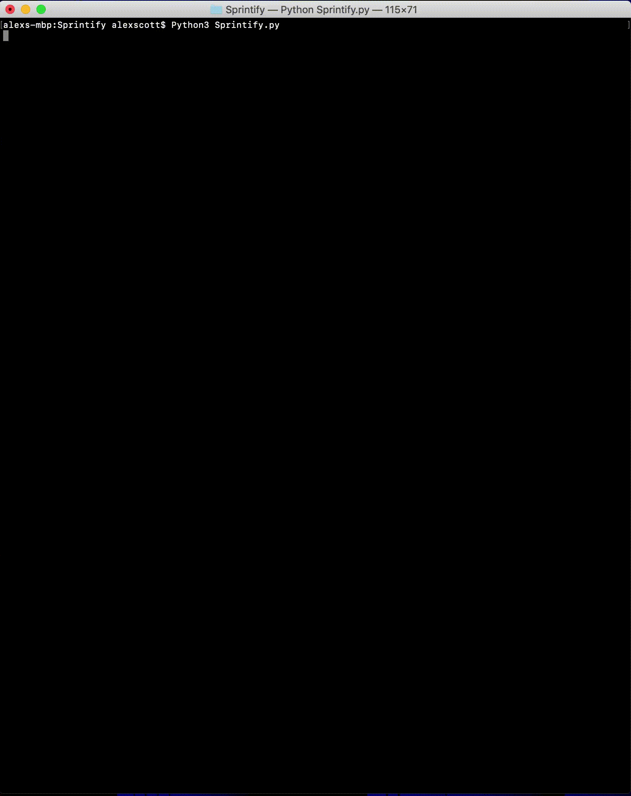
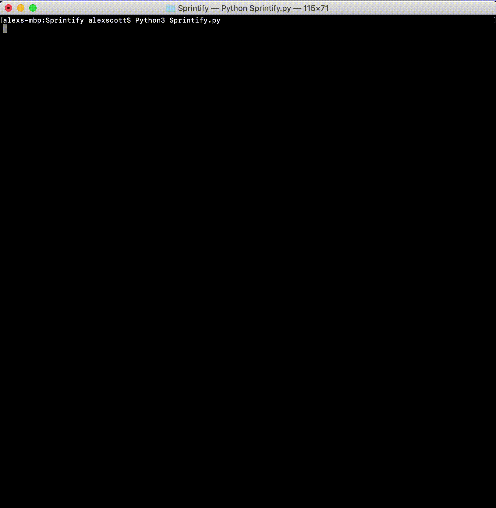

Define a BPM floor and ceiling and filter a Spotify playlist. Songs within range are kept. Instead of filtering, you can also generate a new playlist using Spotify's song recommendations based on a track. For both features, users can create a new playlist, or add to one they've already made.

# Getting Started

This project uses Python 3. Use a package manager such as pip to install **spotipy**. If you do not have pip for python3 installed, you can try bootstraping from the standard library by typing:

```bash
python3 -m ensurepip --default-pip
```
To check if you currently have pip installed, type:
```bash
pip3 --version 
```
If you have pip3 installed, type:
```bash
pip3 install spotipy
```
Visit https://spotipy.readthedocs.io/en/latest/#installation if you have furthur issues installing spotipy. 

In order to run this program, you will need to create a Spotify developer account at https://developer.spotify.com/dashboard/login. Once you have done so, create a Client Id titled "Sprintify" for a Desktop App.
By doing so, you will have created: 
* Client ID
* Client Secret

Open Sprintify.py, and enter your newly created Client ID and Client Secret. This will pair you Spotify account with your instance of Sprintify.py, and will let you create and add to your playlists.

Your Spotify username can be found by navigating to one's user page on the Spotify desktop app, sharing the User's Uri, and copying what's after "user:'

To run, type:
```bash
python3 Sprintify.py
```
Afterwords you will be asked to copy the long google URL from the redirected Spotify Login. Paste this into the terminal!

# Filter Existing Playlist


# Generate Playlist


# Spotipy
https://github.com/plamere/spotipy/blob/master/docs/index.rst

https://spotipy.readthedocs.io/en/latest/
